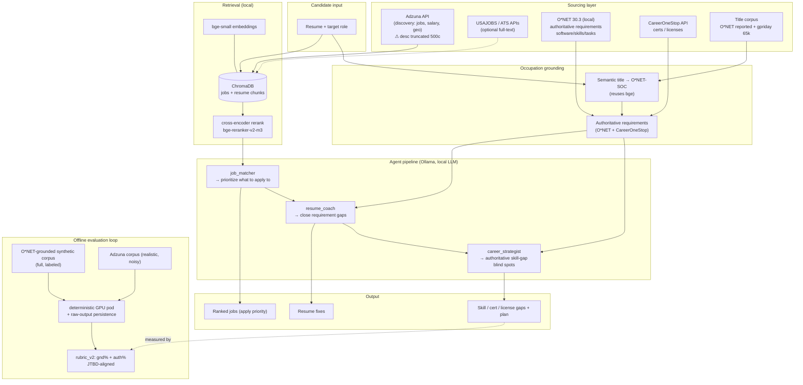

# Path Forward — Job-Search AI Agent

> Living strategy doc. Captures the high-level lessons learned and a hypothesized picture of the
> finished tool (sourcing, models, agents, evaluation). Updated as the improvement loop progresses.
> Last updated: 2026-06-27.
>
> **Status: direction CONFIRMED by user (2026-06-27).** This is the agreed target architecture; the
> open items in §4 are the active workstream. Polished diagram: [`architecture.svg`](architecture.svg).

---

## 0. North star (the JTBD)

> *"As someone searching for a career opportunity/job, I need a tool that **prioritizes what to apply
> to** and **improves my chances of getting hired**, so that I can find employment in the most
> frictionless way."*

Two jobs, mapped to the pipeline and the eval:
1. **Prioritize what to apply to** → `job_matcher` (retrieval + ranking) → eval `job` dimension.
2. **Improve chances of getting hired** → `resume_coach` (`rec`) + `career_strategist` (`spot`).

The eval (`overall = job*0.3 + rec*0.4 + spot*0.3`) is a **proxy**; the JTBD is the goal. When the two
disagree, fix the proxy.

---

## 1. Lessons learned (high-level)

**L1 — The evaluation, not the model, is the binding constraint.**
The biggest gains this loop came from *fixing how we measure*, not from prompt/lever tweaks. The v1
rubric scored blind spots by substring-match against job postings; it was provably blind to good advice
(cell `stay_adz`: occupation-grounded advice went 2%→36% and `overall` registered **zero** change).
`rubric_v2` (a skill is grounded if it's in a posting **OR** a real occupation requirement) flipped
`stay_synth` from −0.124 to **+0.101** on the *same generated advice*.

**L2 — Job-posting text is the hidden bottleneck.**
Adzuna's free API truncates descriptions at **500 chars** (99% cut mid-sentence) — the requirements
section, which is exactly what "improve hire chances" needs, is gone. Synthetic postings were the
opposite failure: 162-char curated blurbs that *gamed* posting-grounding. Neither represents a real
posting. **Don't depend on posting text for requirements.**

**L3 — Authoritative occupation data (O*NET) is the unlock.**
Free, US, public-domain, and crisp (posting-derived tokens like "Epic", "AutoCAD", "Alteryx"). Used as
the *source of truth for what a role requires*, it sidesteps the truncation problem entirely. This is
the right substrate for gap-finding — what ESCO (verbose, non-posting-matching competence labels) never
delivered.

**L4 — Occupation matching is make-or-break.**
Naive substring matching mis-maps titles (Nurse → Health Informatics, Data Scientist → InfoSec).
Semantic matching (reusing the bge embedder) fixes 7/8 persona roles @ cos 0.89–0.98. **But** aspirational
career-changer titles still match below the confidence gate → the authoritative layer misfires for
switchers (the audience that needs it most). Reported-title anchors are the known fix.

**L5 — Prompt/graph levers are marginal; sourcing + measurement are where the leverage is.**
The ESCO graph helped only in embedding/filter space (retrieval, validate), died in generation prompts.
`validate`+`few-shot` were synergistic but tiny (+0.034). The order-of-magnitude moves are (a) right
data source, (b) right metric.

**L6 — Measure deterministically or don't bother.**
RunPod's heterogeneous serverless fleet adds ±0.2/cell noise that swamps real effects. A dedicated
single-GPU pod (greedy, sequential) is the instrument for any sub-0.1 A/B. Persisting raw agent outputs
lets every future rubric version re-score **offline for $0**.

**L7 — Economy through cheap-first discipline.**
Free local screens (token-overlap, occupation-match validation, raw-output re-scoring) before any paid
pod run. Whole improvement loop to date ≈ **$19–21** of RunPod credit.

---

## 2. Hypothesized final tool

### 2a. Sourcing (separate "discovery" from "requirements")
| Need | Source | Status |
|---|---|---|
| **Discovery** — which jobs exist, where, salary, geo | **Adzuna** (free, broad, salary-rich). Optionally **USAJOBS** (federal, full-text) / **ATS APIs** (Greenhouse/Lever) for full postings | live |
| **Authoritative requirements** — what a role *really* needs | **O*NET 30.3** (local, free, US): Software/Tech Skills + Essential Skills + Tasks | built (opt-in) |
| **Non-tech credentials** — licenses/certs (RN, ACLS, Journeyman) | **CareerOneStop API** (US-gov, free; creds in `.env`) | researched, not wired |
| **Title → occupation normalization** | O*NET Reported Titles + **gpriday/job-titles** (65k) via semantic match | built |

Principle: **Adzuna (or any aggregator) finds jobs; O*NET says what they require.** The tool never
depends on a truncated posting to identify a skill gap.

### 2b. Models (local-first, US-developed preferred)
| Role | Current | US-developed note |
|---|---|---|
| Agent LLM | Ollama `llama3.1:8b` (evals); `qwen2.5:3b` default | **llama3.1 = US (Meta) ✓**. Prefer Llama family for US-alignment; qwen (Alibaba) is a flagged non-US fallback for low-VRAM. |
| Embeddings | `BAAI/bge-small-en-v1.5` | bge = non-US (BAAI). US alternatives screened: **Snowflake Arctic**, **Nomic** — swap if the quality tradeoff is acceptable (flagged). |
| Reranker | `bge-reranker-v2-m3` (cross-encoder) | non-US; revisit if a comparable US reranker emerges. |

All local, free, CPU-friendly where possible (the project ethos: niche fine-tuning to candidate needs,
generalizable, not compute-heavy).

### 2c. Agents (3-agent pipeline + 2 data layers)
1. **`job_matcher`** — ranks retrieved postings to the candidate → *prioritize what to apply to*.
2. **`resume_coach`** — resume fixes that **close real requirement gaps** for the target role → *improve hire chances* (`rec`, highest weight).
3. **`career_strategist`** — **authoritative skill/cert/license-gap blind spots** (target occupation's real requirements minus the resume) → *improve hire chances* (`spot`).

Feeding 2 & 3: an **occupation-matching layer** (title → O*NET-SOC) and an **authoritative-requirements
layer** (O*NET/CareerOneStop), so advice is grounded in real role requirements, not truncated postings.

### 2d. Evaluation (the instrument)
- **`rubric_v2`**: occupation-grounded blind-spot scoring (posting OR occupation requirement; bonus if both). Versioned (`rubric_version` column) so history reproduces.
- **JTBD-aligned metrics**: `gnd%` (posting demand) **+** `auth%` (occupation grounding), reported side by side.
- **Test bed**: O*NET-grounded **synthetic** corpus (full-length, labeled, controlled) + **Adzuna** (realistic, noisy, truncated). Synthetic is being regenerated to be JTBD-realistic.
- **Harness**: deterministic single-GPU pod for paid A/Bs; raw-output persistence for free offline re-scoring.

---

## 3. Systems architecture (confirmed)

Polished render: [`architecture.svg`](architecture.svg). Editable source below.

---

## 4. Open questions / next steps
- **Regenerate synthetic** as O*NET-grounded, full-length, labeled postings (in progress) → rerun A/B → re-evaluate gaps.
- **Career-changer occupation matching**: add reported-title anchors so aspirational/switching titles clear the confidence gate (currently the authoritative layer misfires for switchers).
- **Wire CareerOneStop certs/licenses** for non-tech credential gaps (RN license, ACLS, Journeyman).
- **Decide blend-vs-replace** for grounding long-term, and whether to extend rubric_v2 to `rec` (R3) and `job` fit/winnability (R2).
- **Full-text sourcing** (USAJOBS / ATS) only if employer-specific must-haves prove necessary beyond O*NET requirements.
- **US-model alignment**: evaluate Arctic/Nomic embeddings vs bge if the quality tradeoff is acceptable.
