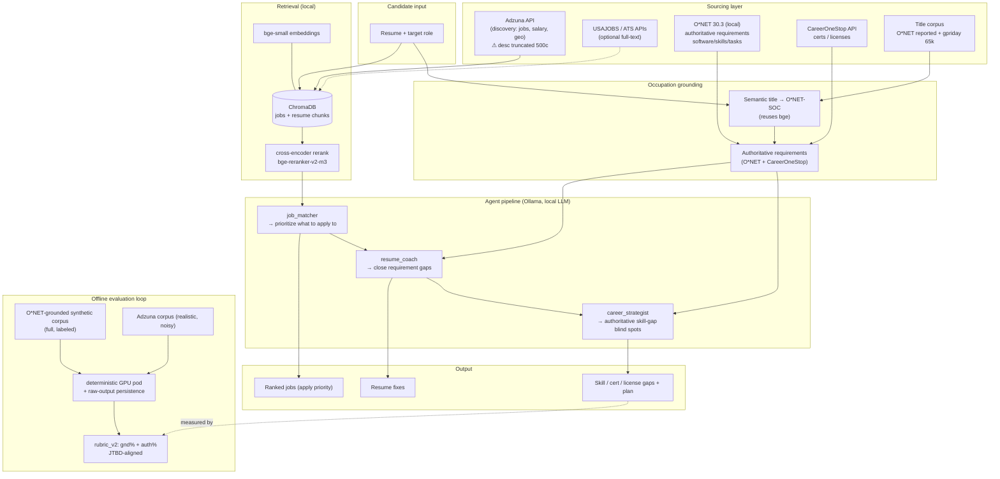

# Path Forward — Job-Search AI Agent

> Living strategy doc. Captures the high-level lessons learned and a hypothesized picture of the
> finished tool (sourcing, models, agents, evaluation). Updated as the improvement loop progresses.
> Last updated: 2026-06-27.
>
> **Status: direction CONFIRMED.** Iter6 complete (rubric_v2 + O*NET-grounded regen + Tier-1 personas,
> AUTHORITATIVE_GAPS off→on +0.198). A full JTBD-alignment audit (§4) + prioritized backlog (§5) were
> folded in 2026-06-27. **§5 is the active workstream.** Polished diagram: [`architecture.svg`](architecture.svg).

---

## 0. North star (the JTBD)

> *"As someone searching for a career opportunity/job, I need a tool that **prioritizes what to apply
> to** and **improves my chances of getting hired**, so that I can find employment in the most
> frictionless way."*

Two jobs, mapped to the pipeline and the eval:
1. **Prioritize what to apply to** → `job_matcher` (retrieval + ranking) → eval `job` dimension.
2. **Improve chances of getting hired** → `resume_coach` (`rec`) + `career_strategist` (`spot`).

The eval (`overall = job*0.3 + rec*0.4 + spot*0.3`) is a **proxy**; the JTBD is the goal. When the two
disagree, fix the proxy.

---

## 1. Lessons learned (high-level)

**L1 — The evaluation, not the model, is the binding constraint.**
The biggest gains this loop came from *fixing how we measure*, not from prompt/lever tweaks. The v1
rubric scored blind spots by substring-match against job postings; it was provably blind to good advice
(cell `stay_adz`: occupation-grounded advice went 2%→36% and `overall` registered **zero** change).
`rubric_v2` (a skill is grounded if it's in a posting **OR** a real occupation requirement) flipped
`stay_synth` from −0.124 to **+0.101** on the *same generated advice*.

**L2 — Job-posting text is the hidden bottleneck.**
Adzuna's free API truncates descriptions at **500 chars** (99% cut mid-sentence) — the requirements
section, which is exactly what "improve hire chances" needs, is gone. Synthetic postings were the
opposite failure: 162-char curated blurbs that *gamed* posting-grounding. Neither represents a real
posting. **Don't depend on posting text for requirements.**

**L3 — Authoritative occupation data (O*NET) is the unlock.**
Free, US, public-domain, and crisp (posting-derived tokens like "Epic", "AutoCAD", "Alteryx"). Used as
the *source of truth for what a role requires*, it sidesteps the truncation problem entirely. This is
the right substrate for gap-finding — what ESCO (verbose, non-posting-matching competence labels) never
delivered.

**L4 — Occupation matching is make-or-break.**
Naive substring matching mis-maps titles (Nurse → Health Informatics, Data Scientist → InfoSec).
Semantic matching (reusing the bge embedder) fixes 7/8 persona roles @ cos 0.89–0.98. **But** aspirational
career-changer titles still match below the confidence gate → the authoritative layer misfires for
switchers (the audience that needs it most). Reported-title anchors are the known fix.

**L5 — Prompt/graph levers are marginal; sourcing + measurement are where the leverage is.**
The ESCO graph helped only in embedding/filter space (retrieval, validate), died in generation prompts.
`validate`+`few-shot` were synergistic but tiny (+0.034). The order-of-magnitude moves are (a) right
data source, (b) right metric.

**L6 — Measure deterministically or don't bother.**
RunPod's heterogeneous serverless fleet adds ±0.2/cell noise that swamps real effects. A dedicated
single-GPU pod (greedy, sequential) is the instrument for any sub-0.1 A/B. Persisting raw agent outputs
lets every future rubric version re-score **offline for $0**.

**L7 — Economy through cheap-first discipline.**
Free local screens (token-overlap, occupation-match validation, raw-output re-scoring) before any paid
pod run. Whole improvement loop to date ≈ **$19–21** of RunPod credit.

---

## 2. Hypothesized final tool

### 2a. Sourcing (separate "discovery" from "requirements")
| Need | Source | Status |
|---|---|---|
| **Discovery** — which jobs exist, where, salary, geo | **Adzuna** (free, broad, salary-rich). Optionally **USAJOBS** (federal, full-text) / **ATS APIs** (Greenhouse/Lever) for full postings | live |
| **Authoritative requirements** — what a role *really* needs | **O*NET 30.3** (local, free, US): Software/Tech Skills + Essential Skills + Tasks | built (opt-in) |
| **Non-tech credentials** — licenses/certs (RN, ACLS, Journeyman) | **CareerOneStop API** (US-gov, free; creds in `.env`) | researched, not wired |
| **Title → occupation normalization** | O*NET Reported Titles + **gpriday/job-titles** (65k) via semantic match | built |

Principle: **Adzuna (or any aggregator) finds jobs; O*NET says what they require.** The tool never
depends on a truncated posting to identify a skill gap.

### 2b. Models (local-first, US-developed preferred)
| Role | Current | US-developed note |
|---|---|---|
| Agent LLM | Ollama `llama3.1:8b` (evals); `qwen2.5:3b` default | **llama3.1 = US (Meta) ✓**. Prefer Llama family for US-alignment; qwen (Alibaba) is a flagged non-US fallback for low-VRAM. |
| Embeddings | `BAAI/bge-small-en-v1.5` | bge = non-US (BAAI). US alternatives screened: **Snowflake Arctic**, **Nomic** — swap if the quality tradeoff is acceptable (flagged). |
| Reranker | `bge-reranker-v2-m3` (cross-encoder) | non-US; revisit if a comparable US reranker emerges. |

All local, free, CPU-friendly where possible (the project ethos: niche fine-tuning to candidate needs,
generalizable, not compute-heavy).

### 2c. Agents (3-agent pipeline + 2 data layers)
1. **`job_matcher`** — ranks retrieved postings to the candidate → *prioritize what to apply to*.
2. **`resume_coach`** — resume fixes that **close real requirement gaps** for the target role → *improve hire chances* (`rec`, highest weight).
3. **`career_strategist`** — **authoritative skill/cert/license-gap blind spots** (target occupation's real requirements minus the resume) → *improve hire chances* (`spot`).

Feeding 2 & 3: an **occupation-matching layer** (title → O*NET-SOC) and an **authoritative-requirements
layer** (O*NET/CareerOneStop), so advice is grounded in real role requirements, not truncated postings.

### 2d. Evaluation (the instrument)
- **`rubric_v2`**: occupation-grounded blind-spot scoring (posting OR occupation requirement; bonus if both). Versioned (`rubric_version` column) so history reproduces.
- **JTBD-aligned metrics**: `gnd%` (posting demand) **+** `auth%` (occupation grounding), reported side by side.
- **Test bed**: O*NET-grounded **synthetic** corpus (full-length, labeled, controlled) + **Adzuna** (realistic, noisy, truncated). Synthetic is being regenerated to be JTBD-realistic.
- **Harness**: deterministic single-GPU pod for paid A/Bs; raw-output persistence for free offline re-scoring.

---

## 3. Systems architecture (confirmed)

Polished render: [`architecture.svg`](architecture.svg). Editable source below.

---

## 4. JTBD-alignment audit (2026-06-27)

Full audit of every component that trains, tests, builds, or deploys the tool, vs the JTBD.

### 4.1 Component verdicts
| Component | Verdict | Core misalignment |
|---|---|---|
| Agent orchestration (3 agents) | 🟡 Partial | grounding is *company-citation*, not requirement-based |
| Embedding / retrieval | 🟡 Partial | query is thin (role + 400c resume); "relevance" ≠ "fit/winnability" |
| Personas / synthetic data | 🟢 Mostly | switcher-title bias (orig 11) + auth% circularity risk |
| Eval metrics | 🟡 Partial | only `spot` is JTBD-aligned; `job` & `rec` are not |
| Tests | 🟡 Partial | unit-level only; no JTBD-behavioral assertions |
| **Build / deploy (the product)** | 🔴 **Misaligned** | the shipped Flask app makes the user *upload* jobs — it ranks, doesn't *find* |

### 4.2 The product–eval gap (the biggest finding)
The good logic — Adzuna discovery, O*NET authoritative requirements, occupation matching, CareerOneStop
certs — lives in the **eval/research path, not the shipped product**. The live Flask app (`routes.py` →
`/search`) requires the user to **upload a jobs CSV**, then ranks it. It does not reduce the friction of
*finding* what to apply to — half the JTBD. `AUTHORITATIVE_GAPS` is also opt-in/off in the live pipeline.

### 4.3 Agent context-engineering misalignments (the prompts/data we feed agents)
The orchestration *topology* is right (3 agents → 2 JTBD jobs); the **context fed to them is not**:
- **resume_coach is blind to job requirements.** `agent_resume_coach.py` passes `fmt_jobs(..., detail=False)`
  → only "title at company," no posting text — yet its system prompt *promises* "posting text" and tells it
  to "only claim a skill is required if it appears in a matched job's posting." The highest-weighted dim
  (`rec`=0.4) is structurally unable to do gap-closing. (Same `detail=False` blindness that was fixed for the
  strategist; never fixed here.)
- **We re-truncate the postings we un-truncated.** `JOB_CONTEXT_CHARS=400` clips the ~1,450c postings — and
  the requirements section comes *after* responsibilities, so it's exactly what gets cut. The context layer
  throws away the requirements the data layer produces.
- **job_matcher is told not to prioritize.** Its prompt: "Your job is NOT to find jobs… select, order,
  explain." With a 600c resume snippet, the actual prioritization is embedding similarity; the agent narrates
  it. The candidate's real skills (needed for *fit*) never enter the decision.
- **Tech-biased skill-file exemplars** ("AI/ML Data Scientist — Guidehouse") *train* generation toward
  analytics, wrong for market-rep personas. (The few-shots in `fewshot.py` are field-diverse; the skill files
  aren't.)

### 4.4 The foundational fix: a posting "data dictionary" / section parser
Postings are formulaic: **about-company → role summary → responsibilities → required qualifications →
preferred qualifications → compensation/benefits → EEO**. A section taxonomy + deterministic parser is the
substrate every other fix reaches for:
- **Retrieval becomes fit-aligned** — embed/weight the *qualifications* section, so candidate skills match
  against *requirements* (real "fit"), not a blob diluted by company fluff.
- **The 400c truncation dissolves** — pass the parsed *requirements* section (compact + exactly what matters)
  instead of "first 400 chars" (which grabs the company blurb and misses requirements).
- **Grounding gets precise** and the dictionary becomes the **shared producer/consumer contract** (generator,
  retrieval, 3 agents, rubric all agree what "requirements" means).
- Deterministic/free/local: regex over canonical headers (~70-80% of real postings) + positional fallback.
  Our **synthetic corpus already emits sections + a `requirements` label**; the parser is for *real* postings
  (Adzuna/uploads), making synthetic and real interchangeable downstream.

### 4.5 Context-engineering best practices to adopt
1. **Extract deterministically; let the LLM reason** (biggest lever for an 8B local model) — pre-compute skills,
   sections, fit; hand the agent the *results*.
2. **Structured/typed context over raw text dumps** — feed `requirements: [...]`, not a char-slice.
3. **Deliberate context budgeting** — allocate the 8192 ctx; full requirements for top jobs, full candidate
   *skills* (not a 600c prefix). The 400/600/1500/3000 caps were ad hoc.
4. **Primacy** — surface the candidate's Skills section; don't bury it past the truncation point.
5. **Separate retrieval-context (candidate skills) from generation-context (structured requirements).**
6. **Pass structured artifacts between agents, not display strings** (cf. C1).
7. **Schema fields that force grounding** — add a `requirement_cited` field to BlindSpot/ResumeRec.
8. **Truthful system prompts** — the "Input you will be given" section must match what the agent actually gets.

### 4.6 Eval-validity caveats
- **Circularity:** `auth%` grades blind spots against the *same* O*NET requirements the synthetic corpus is
  built from → synthetic auth% is partly tautological. **Lean on Adzuna** (independent of O*NET) as the unbiased
  signal; `stay_adz +0.365` on real data is the trustworthy number.
- **`job` dim** = retrieval-relevance to persona fields, not fit/winnability. **`rec` dim** = tangibility +
  citations, not gap-closing.

### 4.7 Agents — add roles? No (for now)
3 agents map to the JTBD; the gaps are context + deterministic pre-processing, not a missing role. Don't add
LLM agents for fit-scoring / parsing / profile-building — those are **deterministic**. One *future* role worth
flagging: an **application-drafter** (cover letter / tailored bullets) — the unserved third of "frictionless"
(help *do* the application), after the context fixes land. What we should regenerate is the **existing skill
files** (§4.3/§4.5).

---

## 5. Prioritized action backlog (consolidated 2026-06-27)

Tags: [prod]=shipped product · [ctx]=agent context · [eval] · [data] · [retr]=retrieval · [clean].
**A0 is foundational** — most P0/P1 items want the section layer it provides.

### P0 — foundational + highest-leverage (do first)
- **A0 [data/retr]** Build the **posting section parser + structured job schema** (the data dictionary, §4.4).
  Parse on ingest → store sections in Chroma metadata. Synthetic already conforms. *Unblocks A1, A4, B3, C1.*
- **A1 [ctx]** **resume_coach: give it the requirements** — `detail=True` + inject `missing_requirements`;
  drop/retire `JOB_CONTEXT_CHARS=400` in favor of the structured `requirements` field. Fixes the highest-weighted
  dimension (`rec`=0.4) with a tiny change. *(depends on A0 for real postings; works today on synthetic.)*
- **A2 [data]** **Career-changer occupation matching** — reported-title anchors so aspirational titles clear
  `MIN_CONF`. Unblocks AUTHORITATIVE_GAPS for switchers (the proven `[0,_,0,_]` gap). Cheap, local.

### P1 — close the product gap + finish context/grounding
- **B1 [prod]** **Wire Adzuna discovery into `/search`** (role + geo → fetch postings) so the user supplies a
  role, not a spreadsheet. Closes the biggest JTBD gap (*find*, not just rank).
- **B2 [ctx]** **Replace company-citation grounding with requirement-grounding** in `_run_with_grounding`;
  flip **`AUTHORITATIVE_GAPS` on by default** in production (proven +0.198).
- **B3 [ctx/retr]** **job_matcher → fit, not narration** — build candidate context from a full-resume skills
  extraction (not 600c); reframe prompt to rank by fit = candidate skills ∩ job requirements.
- **B4 [ctx]** **Regenerate the 3 skill files** — truthful "Input you will be given" sections, field-neutral /
  multi-sector exemplars, requirement-grounding `_grounding.md`; add a `requirement_cited` schema field.
- **B5 [eval]** **Make `job` and `rec` dims JTBD-aligned** — add a fit dimension (R2) to job scoring; score
  `rec` on gap-closing (R3). Re-score banked raw outputs for $0 where possible.

### P2 — coverage, validity, cleanup
- **C1 [prod/data]** **Wire CareerOneStop certs/licenses** — the non-tech credential path (CNA/CDL/ServSafe)
  for the Tier-1 personas.
- **C2 [eval]** Flag synthetic **auth% circularity**; weight Adzuna for the unbiased grounding signal.
- **C3 [eval]** Add **JTBD-behavioral integration tests** (e.g., Nurse's top jobs are healthcare-adjacent;
  blind spots occupation-grounded ≥ X%).
- **C4 [data]** Rebalance the original 11 personas' switching targets to **realistic mobility** (not all
  "→ analytics"); investigate the Software Developer `[40,0,0,0]` anomaly.
- **C5 [clean]** Retire/migrate the **ESCO skills layer** to O*NET vocab; replace the tech-biased
  `_SKILL_KEYWORDS` matcher fallback with `onet_requirements`.
- **C6 [retr]** (flagged) Evaluate **US-developed embeddings** (Arctic/Nomic) vs bge.
- **C7 [data]** (optional) **Tier-2 personas** (CDL driver, cook, HVAC tech) for fuller market coverage.

### Throughline
The **skill-gap half** ("improve hire chances") is now JTBD-aligned (iter6: rubric_v2 + regen, +0.198). The
**prioritization half** ("what to apply to") and the **shipped product** are where alignment work remains — and
**A0 (the section layer)** is the structural key that unlocks most of it.
